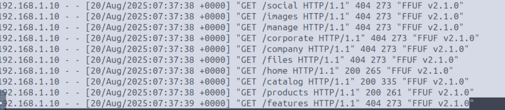
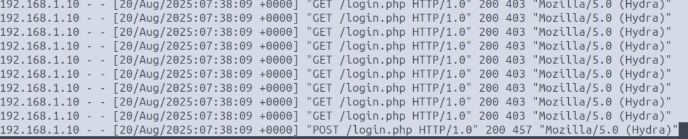
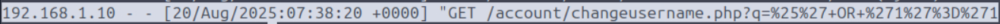

# Objetivo
Entender ataques na web e métodos de detecção por meio da análise de logs e tráfego de rede.

---

# Tipos de ataque

- **Client-Side**  exploram vulnerabilidades no navegador, dispositivo ou comportamento do usuário para executar código malicioso, roubar informações ou realizar ações não autorizadas. Como essas ações ocorrem no ambiente do usuário, o SOC pode ter pouca ou nenhuma visibilidade por meio de logs de servidor e tráfego de rede.

**Principais ataques:** XSS, CSRF e Clickjacking.

- **Server-Side** exploram vulnerabilidades no servidor, aplicação ou backend para obter acesso não autorizado, roubar dados ou comprometer serviços. Como as requisições são processadas pelo servidor, esses ataques geralmente deixam evidências em logs e tráfego de rede, facilitando sua detecção pelo SOC.

**Principais ataques:** Brute Force, SQL Injection (SQLi) e Command Injection.

---

# Análise de logs

Na análise, é importante observar campos como **IP de origem | timestamp | método/recurso solicitado | status code | tamanho da resposta | referrer e User-Agent**. Padrões como muitos 404, requisições repetidas em pouco tempo ou ferramentas como sqlmap e wpscan, podem indicar atividade maliciosa.

**Limitações:** Logs podem não registrar o conteúdo do corpo de requisições POST e nem sempre registram query strings de GET, dependendo do servidor e da configuração. Portanto, eles mostram que uma requisição ocorreu, mas podem não revelar o conteúdo completo.

---

# Desafio do lab
1. *Qual é o User-Agent do atacante durante a execução do fuzzing de diretório?*
2. *Qual é o nome da página na qual o atacante realiza um ataque de brute force?*
3. *Qual é o payload SQLi completo e decodificado que o atacante usa no formulário /changeusername.php?*
---
1. Nas primeiras linhas do log aparece user-agent **"FFUF v2.1.0"**, pesquisando descobri que é uma ferramenta "fuzzing web de alta velocidade e código aberto".

2. Algumas linhas abaixo se nota diversas requisções GET em **/login**.

3. Decodificando no CyberChef fica **%' OR '1'='1**.

