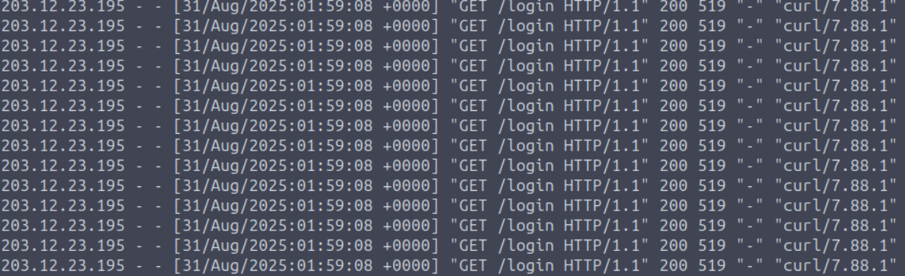
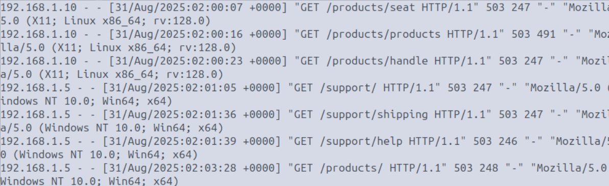
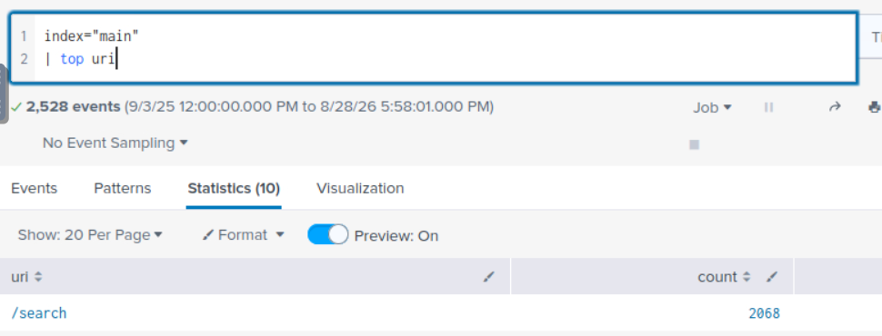
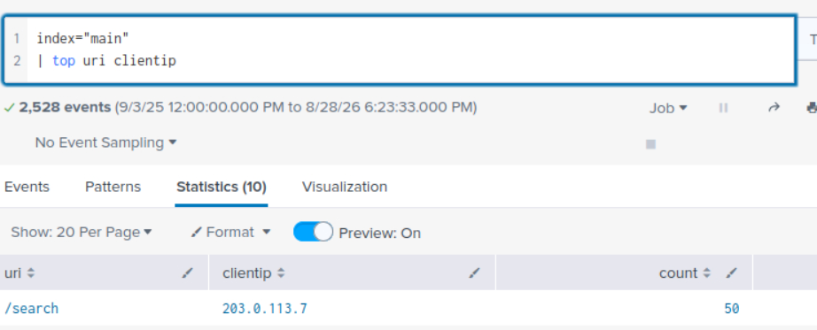
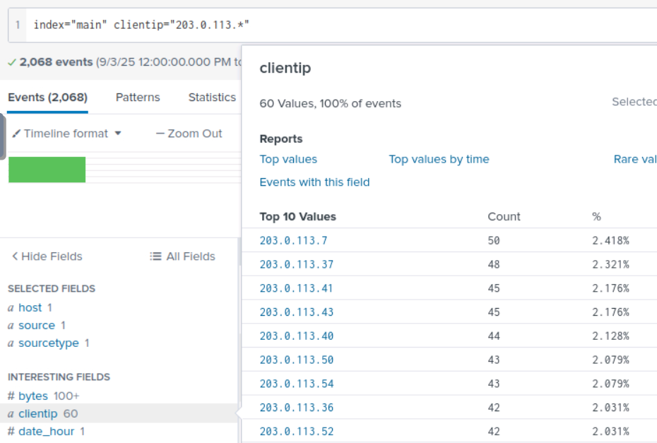
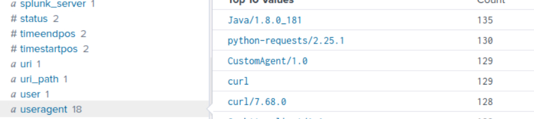
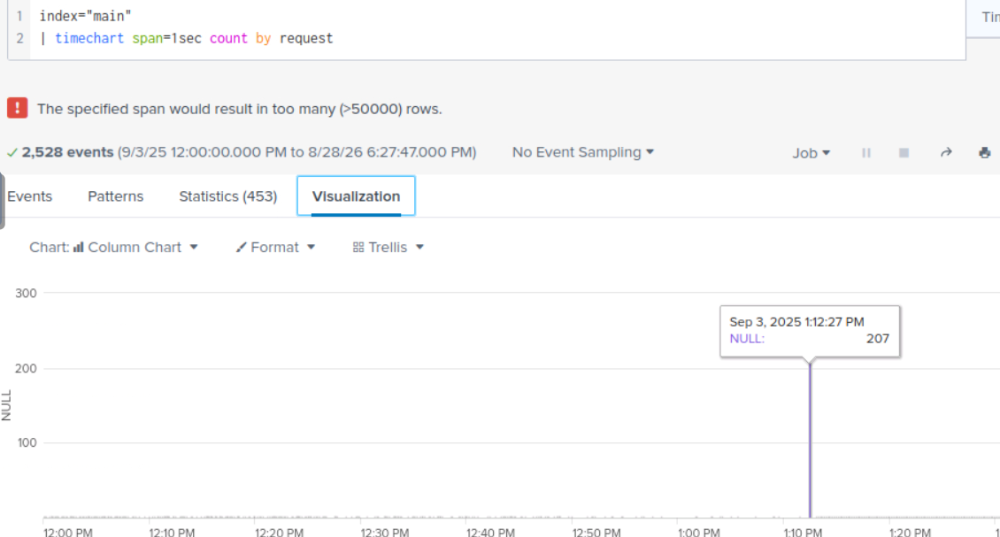
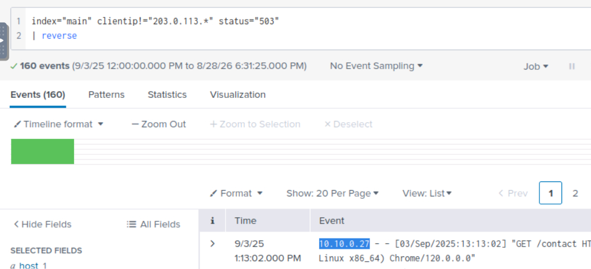

# Objetivo
**Denial-of-Service (DoS)** é um ataque cujo objetivo é interromper ou degradar a disponibilidade de um site ou serviço, impedindo que usuários legítimos tenham acesso.
Em **DDoS (Distributed Denial-of-Service)** o tráfego malicioso é originado de múltiplos sistemas, tornando a mitigação mais complexa.

É importante analisar web logs e padrões de tráfego para identificar sinais de DoS/DDoS e aplicar técnicas de detecção e mitigação.

---

# DoS e DDoS
Denial-of-Service (DoS) busca tornar um serviço indisponível ou degradar seu funcionamento ao consumir excessivamente seus recursos. Neste contexto, o foco está na camada de aplicação (Layer 7), onde requisições maliciosas podem sobrecarregar aplicações web, bancos de dados ou processos do servidor.

DDoS amplia esse conceito utilizando várias dispositvos, geralmente uma botnet, para gerar grandes volumes de tráfego contra o alvo, tornando o ataque mais escalável e difícil de mitigar.

**Principais tipos:** Slowloris, HTTP Flood, Cache Bypass, Oversized Query, Login/Form Abuse e exploração de falhas na validação de entrada.

Motivações para ataques DoS/DDoS vão além de simplesmente derrubar um serviço. Os atacantes podem buscar **perdas financeiras, extorsão, hacktivismo, distração de defensores, vantagem competitiva, aumento de custos operacionais (Denial of Wallet) ou danos à reputação.**

---

# Detecção em logs
A investigação dos logs envolve identificar padrões anormais de requisições que indiquem sobrecarga ou abuso dos recursos da aplicação.

**Principais indicadores:** alta taxa de requisições, bursts de tráfego, User-Agents incomuns, distribuição geográfica anormal de IPs, aumento de erros 5xx (especialmente 503) e abuso de lógica, como parâmetros que exigem processamento excessivo.

---

# Desafio do lab
1. *Qual o IP do atacante?*
- ao abrir o access.log se nota diversas requests no mesmo segundo vindo do IP **203.12.23.195.**

2. *Qual página está sendo alvo de várias requests?*
- **/login**

3. *Depois do ataque, qual código de erro users legítimos recebem?*
- Comando usado: **cat access.log | grep -v 203.12.23.195 | grep -v 200 | tail** (mostrar só users legítimos | mostrar status que não seja o normal | mostrar resultados após o ataque)

---

# Continuando pelo Splunk
1. *Qual foi o URI mais solicitado?*
- d

2. *Qual clientip fez o maior número de requisições para o URI de destino?*
- d

3. *Quantos endereços IP faziam parte da botnet que atacou o site?*
- d

4. *Qual User-Agent foi mais comumente usado durante o ataque?*
- d

5. *Qual foi o maior número de solicitações feitas por segundo durante o ataque?*
- d

6. *Qual endereço IP legítimo recebeu a primeira resposta de status 503 após o ataque?*
- d

